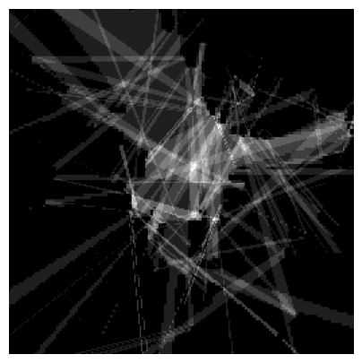

# **I**mage-**P**hysics-**S**imulation

This is a library for 2D Ray-Tracing on an image. For example the Physgen Dataset, [see here](https://huggingface.co/datasets/mspitzna/physicsgen).

Contents:
- [Installation](#installation)
    - [Download Example Data](#download-example-data)
- [Usage](#usage)
- [Ray-Tracing Formats](#ray-tracing-formats)
- [Library Overview](#library-overview)

[> Documentation <](https://M-106.github.io/Image-Physics-Simulation/img_phy_sim.html)

[> Optimization Repo <](https://github.com/M-106/Performance-Analysis-and-Optimization-of-img-phy-sim)

</img>
</img>

> Classical Ray-Beams and ISM

<br><br>

### Installation

This repo only need some basic libraries:
- `numpy` 
- `matplotlib` 
- `opencv-python`
- `scikit-image`
- `joblib`
- `numba`
- `shapely`

If you want to use the `data` module then this package needs also:
- `torch`
- `torchvision`
- `datasets`

<br><br>

You can download / clone this repo and run the example notebook via following Python/Anaconda setup:
```bash
conda create -n img-phy-sim python=3.13 pip -y
conda activate img-phy-sim
pip install numpy matplotlib opencv-python ipython jupyter shapely datasets==3.6.0 scikit-image joblib shapely numba
pip install torch torchvision torchaudio --index-url https://download.pytorch.org/whl/cu126
```

<br><br>

You can also use this repo via [Python Package Index (PyPI)](https://pypi.org/) as a package: 
```bash
pip install img-phy-sim
# or for using `data` module:
pip install img-phy-sim[full]
```

Here the instructions to use the package version of `ips` and an anconda setup:
```bash
conda create -n img-phy-sim python=3.13 pip -y
conda activate img-phy-sim
pip install img-phy-sim
# or for using `data` module:
pip install img-phy-sim[full]
```

To run the example code you also need (these packages are included in `img-phy-sim[full]`):
```bash
pip install datasets==3.6.0
pip install torch torchvision torchaudio --index-url https://download.pytorch.org/whl/cu126
```

<br><br>

### Download Example Data

You can download Physgen data if wanted via the `data.py` using following commands:

```bash
conda activate img-phy-sim
cd "D:\Informatik\Projekte\Image-Physics-Simulation\img_phy_sim" && D:
python data.py --output_real_path ./datasets/physgen_train_raw/real --output_osm_path ./datasets/physgen_train_raw/osm --variation sound_reflection --input_type osm --output_type standard --data_mode train
```

```bash
python data.py --output_real_path ./datasets/physgen_test_raw/real --output_osm_path ./datasets/physgen_test_raw/osm --variation sound_reflection --input_type osm --output_type standard --data_mode test
```

```bash
python data.py --output_real_path ./datasets/physgen_val_raw/real --output_osm_path ./datasets/physgen_val_raw/osm --variation sound_reflection --input_type osm --output_type standard --data_mode validation
```


<br><br>

### Usage

Here we will show following (always for classical ray-traces and ISM):
1. the **basic** usage 
2. **iterative** usage
3. **saving and loading** 

[→ The example notebook can be helpful 👀](./example/physgen.ipynb)

<br><br>

Classical Ray-Tracing:
```python
# calc rays
rays = ips.ray_tracing.trace_beams(rel_position=[0.5, 0.5], 
                                   img_src=input_src, 
                                   directions_in_degree=ips.math.get_linear_degree_range(start=0, stop=360, step_size=5),
                                   wall_values=None, 
                                   wall_thickness=1,
                                   img_border_also_collide=False,
                                   reflexion_order=3,
                                   should_scale_rays=True,
                                   should_scale_img=False)

# show rays on input
ray_img = ips.ray_tracing.draw_rays(rays, detail_draw=False, 
                                    output_format="single_image", 
                                    img_background=input_, ray_value=2, ray_thickness=1, 
                                    img_shape=(256, 256), dtype=float, standard_value=0,
                                    should_scale_rays_to_image=True, original_max_width=None, original_max_height=None,
                                    show_only_reflections=True)
ips.img.imshow(ray_img, size=4)
```

<br><br>

ISM:
```python
reflection_map = ips.ism.compute_reflection_map(
    source_rel=(0.5, 0.5),
    img=ips.img.open(input_src),
    wall_values=[0],   
    wall_thickness=1,
    max_order=1,
    step_px=1,
)

ips.img.imshow(ips.ism.reflection_map_to_img(reflection_map), size=5)
```

<br><br>

Both formats are also available in a **iterative format**.

> Notice that iterative results can lead partwise to extrem poor performance. 


Classical Ray-Tracing:
```python
# compute rays
rays_ = ips.ray_tracing.trace_beams(rel_position=[0.5, 0.5], 
                                   img_src=img_src, 
                                   directions_in_degree=[22, 56, 90, 146, 234, 285, 320],
                                   wall_values=0.0, 
                                   wall_thickness=0,
                                   img_border_also_collide=False,
                                   reflexion_order=2,
                                   should_scale_rays=False,
                                   should_scale_img=True,
                                   iterative_tracking=True,    # IMPORTANT
                                   iterative_steps=None        # IMPORTANT
                                   )
print("\nAccessing works the same, example Ray:", rays_[0][0][:min(len(rays_[0][0])-1, 3)])

# (optional) limit rays to X steps
rays_.reduce_to_x_steps(20)

# (optional) get a given operation
rays_.get_iteration(0)

# export as multiple images
ray_imgs = ips.ray_tracing.draw_rays(rays_, detail_draw=False, 
                                    output_format="single_image", 
                                    img_background=img, ray_value=2, ray_thickness=1, 
                                    img_shape=(256, 256), dtype=float, standard_value=0,
                                    should_scale_rays_to_image=False, original_max_width=None, original_max_height=None)

# show exported images (first 10 imges)
ips.img.advanced_imshow(ray_imgs[:10], title=None, image_width=4, axis=False,
                        color_space="gray", cmap=None, cols=5, save_to=None,
                        hspace=0.2, wspace=0.2,
                        use_original_style=False, invert=False)
```

ISM:
```python
reflection_map_per_time = ips.ism.compute_reflection_map(
    source_rel=(0.5, 0.5),
    img=ips.img.open(input_src),
    wall_values=[0],   
    wall_thickness=1,
    max_order=1,
    step_px=1,
    iterative_tracking=True,
    iterative_steps=6, 
)

ips.img.imshow(ips.ism.reflection_map_to_img(reflection_map_per_time[0]), size=5)

len_ = len(reflection_map_per_time)
ips.img.advanced_imshow([reflection_map_per_time[0], reflection_map_per_time[1], reflection_map_per_time[2],
                         reflection_map_per_time[3], reflection_map_per_time[4], reflection_map_per_time[5]], 
                        title=None, image_width=4, axis=False,
                        color_space="gray", cmap=None, cols=3, save_to=None,
                        hspace=0.2, wspace=0.2,
                        use_original_style=False, invert=False)
```


<br><br>

**Loading and saving:**

Classical Rays
```python
# saving
rays_saved = ips.ray_tracing.trace_beams(rel_position=[0.5, 0.5], 
                                        img_src=img_src, 
                                        directions_in_degree=ips.math.get_linear_degree_range(start=0, stop=360, step_size=10),
                                        wall_values=None, 
                                        wall_thickness=1,
                                        img_border_also_collide=False,
                                        reflexion_order=1,
                                        should_scale_rays=True,
                                        should_scale_img=True)
ips.ray_tracing.print_rays_info(rays_saved)
ips.ray_tracing.save(path="./my_awesome_rays.txt", rays=rays_saved)

# loading
rays_loaded = ips.ray_tracing.open(path="./my_awesome_rays.txt")
```

Or you export the rays as image and save and load the image:
```python
# compute rays
# ... (as before)

# export rays
# ... (as before)

# saving
ips.img.save(ray_img, "./cache_iterative_saving.png")

# loading
ray_img = ips.img.open("./cache_iterative_saving.png")
```

<br>

ISM
```python
# saving
ips.img.save(reflection_map, "./cache_iterative_saving.png")

# loading
reflection_map = ips.img.open("./cache_iterative_saving.png")
```


<br><br>

### Ray-Tracing Formats

<br>

> In short:<br>**Pixel-based + stochastic/directed** (original approach here) vs. **continuous + deterministically constructed** (used by noise modelling software).

<br>

**Classic Ray-Tracing Approach (DDA / Pixel Ray Marching)**
* **Forward integration**: Ray is propagated step by step through a **discrete grid** (pixel/grid).
* **Collision model**: A "hit" occurs when the ray enters a **wall cell** (quantization).
* **Reflection**: Occurs **locally at the collision pixel** with a (often quantized) normal/orientation.
* Result: good for "many rays" / field of view, but **not deterministic with regard to reflection paths** (you need directions/sampling).

<br>

**Noise Modeling Approach (image source method / geometric acoustics)**
* **Path construction**: Reflection paths are constructed **deterministically** via **mirror sources** (virtual sources).
* **Continuous geometry**: works in $\mathbb{R}^2 / \mathbb{R}^3$ with lines/segments/polygons ("infinity-based" in the sense of *continuous space*, not raster).
* **Validation**: Path is then accepted/rejected via **visibility/occlusion checks**.
* Result: Delivers **all specular paths up to order N** without angle sampling.


<br><br>


### Library Overview

- Img-Phy-Sim (ips)
    - `ray_tracing`
        - `trace_beams`: load an image, extract the wall-map and trace multiple beams
        - `draw_rays`: draw/export the rays as/inside an image
        - `trace_and_draw_rays`: combines `trace_beams` and `draw_rays` in order to get directly an image output
        - `print_rays_info`: get some interesting informations about your rays
        - `save`: save your rays as txt file
        - `open`: load your saved rays txt file
        - `get_linear_degree_range`: get a range for your beam-directions -> example beams between 0-360 with stepsize 10
        - `merge_rays`: merge 2 rays to one 'object'
    - `ism`
        - `compute_reflection_map`: Evaluates all valid ISM paths from one source to a receiver grid and accumulates path counts
        - `reflection_map_to_img`: Normalizes the reflection map from 0.0-1.0 to 0.0-255.0 
    - `img`
        - `open`: load an image via Open-CV
        - `save`: save an image
        - `imshow`: show an single image (without much features)
        - `advanced_imshow`: show multiple images with many options
        - `show_image_with_line_and_profile`: show an image with a red line + the values of the image on this line
        - `plot_image_with_values`: plot an image with it's value plotted and averaged to see your image in values
    - `math`
        - `get_linear_degree_range`: generate evenly spaced degrees within a range
        - `degree_to_vector`: convert a degree angle to a 2D unit vector
        - `vector_to_degree`: convert a 2D vector into its corresponding degree
        - `normalize_point`: Normalize a 2D point to [0, 1] range
        - `denormalize_point`: Denormalize a 2D point to pixel coordinates
        - `numpy_info`: Get statistics about an numpy array
    - `eval`
        - `calc_metrices`: calculate F1, Recall and Precision between rays (or optinal an image) and an image
    - `data`
        - `PhysGenDataset()`: PyTorch dataset wrapper for PhysGen with flexible input/output configuration
        - `resize_tensor_to_divisible_by_14`: resize tensors so height and width are divisible by 14
        - `get_dataloader`: create a PyTorch DataLoader for the PhysGen dataset
        - `get_image`: retrieve a single dataset sample (optionally as NumPy arrays)
        - `save_dataset`: export PhysGen inputs and targets as PNG images to disk


That are not all functions but the ones which should be most useful. Check out the documentation for all functions.


